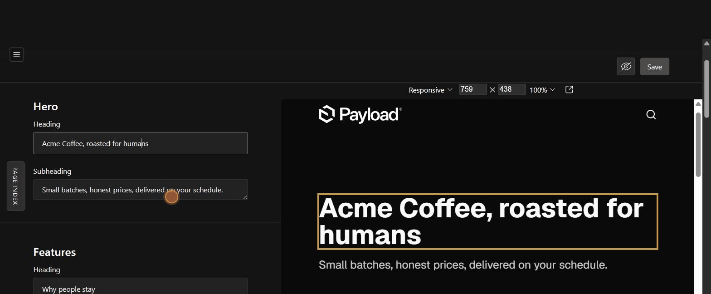

# payload-live-nav

Section navigation for the Payload admin, wired to Live Preview. Click a section in a small index panel and both the edit form and the preview jump there. Focus any field and the preview scrolls to that element and flashes it.



Payload's Live Preview shows you the page while you edit, but on a long page you still scroll the form and the preview separately, hunting for the field you want. This closes that gap.

## What you get

- **Focus bridge.** Focus a field in the edit form and the previewed page scrolls to the element carrying that field's `data-cms-field` attribute, with a short flash so your eye lands on it. Zero config, works on every edit view with Live Preview.
- **Page index.** A collapsible rail on the edit views you configure, listing the page's sections. One click scrolls the form to that group and sends the preview to the same section.

## Install

```sh
pnpm add payload-live-nav
```

## Setup

**1. Register the plugin** in `payload.config.ts`. The `entities` map is keyed by collection or global slug; each listed entity gets the page index on its edit view.

```ts
import { liveNavPlugin } from 'payload-live-nav'

export default buildConfig({
  plugins: [
    liveNavPlugin({
      entities: {
        homepage: {
          sections: [
            { label: 'Hero', path: 'hero', adminLabel: 'Hero (top of page)' },
            { label: 'FAQ', path: 'faq' },
          ],
        },
      },
    }),
  ],
})
```

`path` is the section group's field path in the form. `adminLabel` is the group's label as the admin renders it; it defaults to `label` and only matters for the fallback described below.

**2. Drop the listener into the previewed page.** React (Next.js layout or page):

```tsx
import { LiveNavListener } from 'payload-live-nav/frontend'

// anywhere in the previewed page tree, renders nothing
<LiveNavListener />
```

Not on React? The core is framework agnostic:

```ts
import { attachLiveNavListener } from 'payload-live-nav/frontend'

const detach = attachLiveNavListener(document)
```

**3. Tag your elements.** Give the rendered elements a `data-cms-field` attribute matching their field path:

```tsx
<h1 data-cms-field="hero.headline">{hero.headline}</h1>
```

A group path like `faq` needs no element of its own: the listener resolves it through the first child it finds (`faq.headline`), and unmatched child paths climb to their parent.

## How it works, and what it depends on

The admin side watches `focusin` events and reads Payload's internal `field-<path>` DOM id scheme to learn which field you are in, then posts the path into the Live Preview iframe with `postMessage` (same origin only, both directions). That id scheme is internal to Payload: if a future version changes it, this plugin degrades to a quiet no-op rather than breaking your admin, and the page index falls back to matching the group's heading text (that is what `adminLabel` is for).

Three edge cases this plugin carries fixes for, learned in production:

1. **Smooth scrolling dies on re-render.** Closing the index panel re-renders the document and Chrome cancels in-flight smooth scrolls. Form jumps are instant; only the iframe, its own document, scrolls smooth.
2. **The admin form scrolls via the body**, and `body.getBoundingClientRect().top` goes negative once scrolled. Root scrolling therefore uses the viewport relative offset directly instead of container relative math, which double counts.
3. **Payload lazy renders form content after long jumps**, shifting the layout right after landing. The jump re-measures and re-corrects at 250ms and 650ms; the taps are instant and imperceptible.

## Compatibility

| Payload | Status |
| --- | --- |
| 3.85 | tested |
| 4.x | untested, internals may differ |

Same origin setups only: the admin and the previewed site must share an origin, which is Payload's default Live Preview arrangement.

## License

MIT
